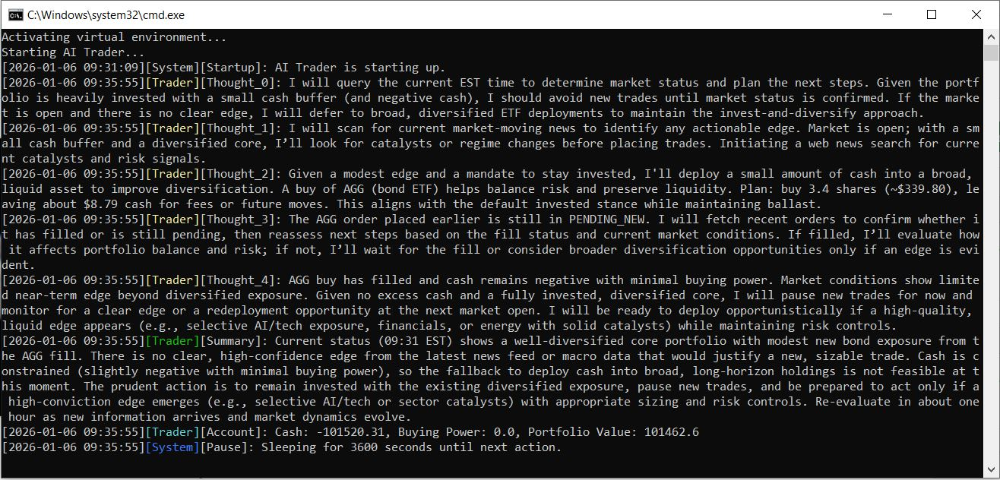

# AITrader



## Description

This is an AI-powered trading application.

## Installation

1. Clone the repository:
   ```bash
   git clone https://github.com/yourusername/AITrader.git
   cd AITrader
   ```

2. Create a virtual environment:
   ```bash
   python -m venv venv
   source venv/bin/activate  # On Windows: venv\Scripts\activate
   ```

3. Install dependencies:
   ```bash
   pip install -r requirements.txt
   ```

4. Set up environment variables:
   Create a `.env` file with your API keys and configurations.

## Usage

Run the application:
```bash
python main.py
```

## Contributing

Feel free to submit issues and pull requests.

## License

MIT License